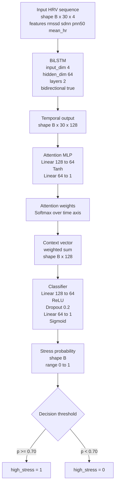

# Arquitetura da Rede Neural (BiLSTM + Atenção)

Este documento descreve a arquitetura de inferência/treino utilizada no projeto para estimativa de probabilidade de estresse com base em métricas de HRV.

## 1) Resumo estrutural

- Entrada temporal: sequência de 30 passos com 4 features por passo.
- Backbone: BiLSTM bidirecional (2 camadas, hidden 64 por direção).
- Mecanismo de atenção temporal para ponderar quais instantes da janela têm maior contribuição.
- Cabeça de classificação com saída sigmoide para probabilidade em [0, 1].

## 2) Diagrama Mermaid

Arquivo editável do diagrama: `docs/diagrams/bilstm_attention_architecture.mmd`.

## 3) Dimensionalidade por camada

- Input: `B x 30 x 4`
- BiLSTM output: `B x 30 x 128`
- Attention scores: `B x 30 x 1`
- Attention weights: `B x 30 x 1`
- Context vector: `B x 128`
- Classifier output: `B x 1`
- Final output (squeeze): `B`

## 4) Justificativa técnica

- A componente BiLSTM modela dependências temporais da dinâmica HRV em janela curta.
- A atenção melhora interpretabilidade parcial ao explicitar quais instantes da janela tiveram maior peso na decisão.
- A cabeça sigmoide simplifica a integração operacional com limiar clínico/operacional (`0.70`).

## 5) Observações para apresentação

- A arquitetura atual trabalha com features agregadas de HRV por janela, não com waveform PPG bruto.
- Isso favorece robustez computacional e menor custo de inferência em borda/fog.
- Como extensão, pode-se adicionar camada de calibração de probabilidade por perfil etário/condicionamento.
